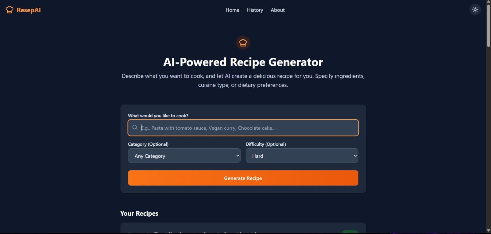

# ResepAI - AI-Powered Recipe Generator



ResepAI is a modern web application that uses AI to generate customized recipes based on user preferences, ingredients, and dietary needs.

## Features

- **AI-Generated Recipes**: Get unique recipes created specifically for your needs using Google's Gemini AI.
- **Recipe History**: Save and access your favorite generated recipes anytime.
- **Filtering Options**: Filter recipes by category, difficulty level, and more.
- **PDF Export**: Download recipes in PDF format for offline access.
- **Share**: Share recipes with friends and family on social media.
- **Dark Mode**: Enjoy a comfortable viewing experience day or night.

## Tech Stack

- **Frontend**: React, TypeScript, Tailwind CSS
- **Backend**: Node.js, Express
- **AI**: Google Gemini API
- **Database**: MongoDB (simulated in-memory for this demo)

## Getting Started

1. Clone the repository
2. Install dependencies:
   ```
   npm install
   ```
3. Start the development server:
   ```
   npm run dev:all
   ```
4. Open your browser and navigate to http://localhost:5173

## API Endpoints

- `GET /api/generate-recipe` - Generate a new recipe
- `GET /api/history` - Get saved recipes
- `POST /api/save-recipe` - Save a recipe to history
- `POST /api/rate-recipe` - Rate a recipe
- `POST /api/add-comment` - Add a comment to a recipe

## License

MIT

## Acknowledgements

- Google Generative AI for providing the AI model
- Tailwind CSS for the styling framework
- React team for the frontend library